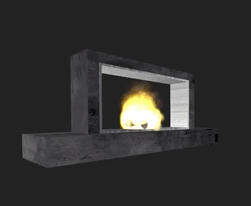

# Skill Sample: Smart Home Fireplace (Python)

This is an Alexa skill sample designed to help you understand the capability interfaces of the Smart Home Skill API. You will build a smart home appliance (a virtual fireplace) to implement and understand the Smart Home Skill APIs.

At the end of this tutorial, you will have an Alexa skill and a supporting AWS backend that responds to commands for Smart Home interaction models. This virtual fireplace will respond to the [PowerController interface](https://developer.amazon.com/en-US/docs/alexa/device-apis/alexa-powercontroller.html) of the Smart Home Skill API, and serve as a base skill from which you can add additional functionality via a series of related Alexa cookbook recipes.

To start this sample, follow the [instructions](./instructions/README.md).

## Resources

### Community

[Amazon Developer Forums](https://forums.developer.amazon.com/spaces/165/index.html)

[Alexa Skills - User Voice](https://alexa.uservoice.com)

### Related Reading

* [Understand the Smart Home Skill API](https://developer.amazon.com/en-US/docs/alexa/smarthome/understand-the-smart-home-skill-api.html)
* [Steps to Build a Smart Home Skill](https://developer.amazon.com/en-US/docs/alexa/smarthome/steps-to-build-a-smart-home-skill.html)
* [Add Custom Voice Interaction to a Smart Home Skill](https://developer.amazon.com/docs/smarthome/add-custom-voice-interaction-to-a-smart-home-skill.html)

### Particle Fire

[Three particle fire](https://github.com/yomotsu/three-particle-fire)

## Security

See [CONTRIBUTING](CONTRIBUTING.md#security-issue-notifications) for more information.

## License

This library is licensed under the Amazon Software License.
