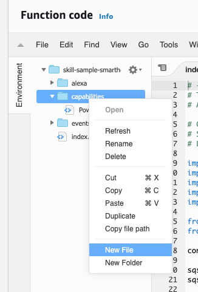
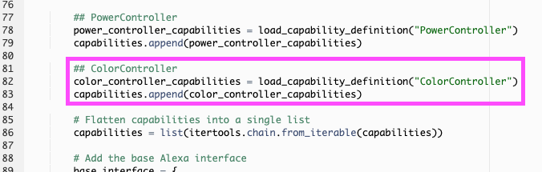
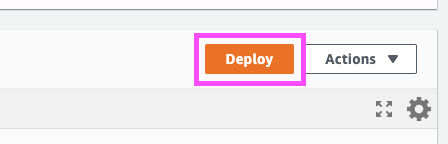
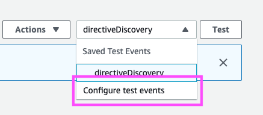
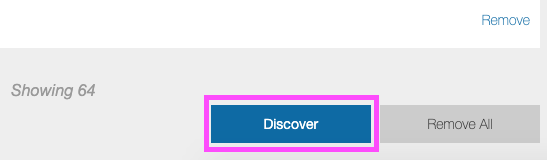
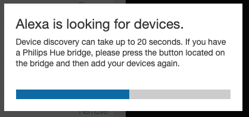

# Smart Home API Alexa.ColorController Recipe

## Prerequisite

**You should have completed the [Virtual Fireplace](https://github.com/alexa/skill-sample-smarthome-fireplace-python) tutorial before continuing with this recipe.**

## About this Recipe

This add-on builds on top of an Alexa-enabled virtual fireplace. It adds a new capability to the fireplace through the Alexa Smart Home SKill API. A device, or _endpoint_, can implement the combination of capability interfaces that best represent its features. For example, a light that can be turned on and off and dimmed might implement two interfaces: PowerController and BrightnessController. A similar light that has these two features and also supports tunable white light might also implement ColorTemperatureController.

In this example, you'll use the [`Alexa.ColorController`](https://developer.amazon.com/en-US/docs/alexa/device-apis/alexa-colorcontroller.html) (ColorController) interface to change the color of flame your virtual fireplace produces. When you use the ColorController interface, the voice interaction model is already built for you, so you won't need to worry about setting up invocation phrases like "Alexa, change the fireplace to the color X," and you can instead focus on the logic that brings your fireplace to life.

When you've completed the steps in this recipe, you'll be able to change the color of the the flame to colors like _red_, _lime green_, _hot pink_, and many more.


## Step 1. Start your virtual fireplace client

1. From the command line, navigate to the client directory of your *skill-sample-smarthome-fireplace-python* directory. Remember, this was the directory created when you completed [the base project that this recipe builds on](https://github.com/alexa/skill-sample-smarthome-fireplace-python).
2. Run the command `npm run start` to start the client.
3. Once started, visit [http://localhost:9000/](http://localhost:9000) to view the virtual fireplace.
4. Leave the web page open and the client running in the background and proceed with the next step.

## Step 2. Add support for the Alexa.ColorController interface to your AWS Lambda project

When your Lambda skill was created in the "Create the Backend Resources" step of [the previous tutorial](https://github.com/alexa/skill-sample-smarthome-fireplace-python), a __capabilities__ folder was created in your Lambda deployment package. Let's add a new capability to your virtual fireplace by copying the contents of [ColorController.json](./capabilities/ColorController.json) and pasting to a new file in your Lambda's __capabilities__ folder:

Right-click on "capabilities", the select "New File." Name the file "ColorController.json", and paste the contents you just copied. Save the file when you're done.



## Step 3. Add the ColorController capability to your virtual fireplace

Update "index.py" to handle `Alexa.ColorController` requests from your skill. Locate the `# Flatten capabilities into a single list` comment and add the following code just above it:

```
...

## ColorController
color_controller_capabilities = load_capability_definition("ColorController")
capabilities.append(color_controller_capabilities)

# Flatten capabilities into a single list
capabilities = list(itertools.chain.from_iterable(capabilities))
...        
```

When you've added the code, it should look like the following:



## Step 4. Add code to handle the `Alexa.ColorController` namespace

When a user of your skill interacts with your virtual fireplace, a JSON request with a "namespace" is sent to your skill. Search the code in "index.py" to find `if namespace == 'Alexa.PowerController':`. This code block handles the `Alexa.PowerController` namespace, which you'll remember can control the power of your virtual fireplace.

There are placeholder comments for various capabilities. Look for the code block

```
if namespace == 'Alexa.ColorController':
    # Continue your learning!
    # You can implement Alexa.ColorController for your virtual fireplace via 
    #   https://github.com/alexa/skill-sample-smarthome-fireplace-python/tree/main/continued-learning/ColorController
    pass
```

and replace it with the following:

```
if namespace == 'Alexa.ColorController':
    endpoint_id = request['directive']['endpoint']['endpointId']
    token = request['directive']['endpoint']['scope']['token']
    correlation_token = request['directive']['header']['correlationToken']
    
    color_value = request['directive']['payload']['color']
    logger.info('+++++ color_value')
    logger.info(color_value)
    
    message = {
        'endpointId':endpoint_id, 
        'namespace':'Alexa.ColorController', 
        'name':'color', 
        'value':color_value
    }
    
    if send_device_state_message(message):
        response = AlexaResponse({
            'correlationToken': correlation_token,
            'token': token,
            'endpointId': endpoint_id
        })
        
        response.add_context_property({
            'namespace':'Alexa.ColorController', 
            'name': 'color', 
            'value': color_value
        })
        
        response = response.get()
        return send_response(response)
    else:
        response = AlexaResponse({
            'name': 'ErrorResponse',
            'payload': {
                'type': 'ENDPOINT_UNREACHABLE',
                'message': 'Unable to set endpoint state.'
            }
        }).get()
        return send_response(response)
```

Note that Python is sensitive to proper indentation. Make sure the code block you pasted is indented properly, and deploy index.py by clicking the "Deploy" button:



## Step 5. Send a Smart Home test event

First, ensure that you have deployed your changes in "index.py". Then, add a test event for the `ColorController` directive to your Lambda function.

1. On the function page for _skill-sample-smarthome-fireplace-python_, select the **Select a test event** dropdown from the top menu of the function and click **Configure test events**.

    

2. In the dialog that opens, leave **Create new test event** selected and leave the default template.
3. For the _Event name_ enter: `directiveColorController`.
4. Copy and paste the contents of [ColorController.request.json](./events/ColorController.request.json) into the text field at the bottom of the dialog replacing its contents.
5. Click **Create**.
6. With the *directiveColorController* test selected in the dropdown, click **Test**.
7. Open the **Execution result** details to inspect the result and notice that your handler now a response where the `value` contains the _hue_, _saturation_, and _brightness_ values of 

```
"value": {
    "hue": 350.5,
    "saturation": 0.7138,
    "brightness": 0.6524
}
```

If your virtual fireplace client is running, you'll notice that the flame color is now a pink-red hue.


 
## Step 6. Notify Alexa that your virtual fireplace has a new capability

There are a few ways to notify Alexa that your virtual fireplace has a new capability. One such way is using a proactive notification, which sends an updated list of capabilities from your device to [the Alexa Event Gateway](https://developer.amazon.com/en-US/docs/alexa/smarthome/send-events-to-the-alexa-event-gateway.html). Another way, and the one used in this recipe, is to simply re-discover your devices so that a discovery event can be sent to your skill and receive an updated list of capabilities in return.

Rediscover your devices:

1. Visit your Devices list at [https://alexa.amazon.com/spa/index.html#appliances](https://alexa.amazon.com/spa/index.html#appliances). You may need to login with your Amazon account.
2. Scroll to the bottom of your list and click the "Discover" button. 



3. After 20-30 seconds, your devices will be rediscovered, and the capability you just added will now be available to you.



## Step 7. Test your virtual fireplace's new capability

You have now added a capability to your virtual fireplace, and a handler to handle incoming requests to change the color of the flame. Let's interact with your fireplace to see the ColorController in action. 

### Option 1: Control your virtual fireplace through an Alexa device

1. Say the following: `Alexa, set the fireplace to sea green`

    If successful, Alexa should respond with an "OK", and in your browser you should notice the flame color change to sea green.

2. Type or say the following: `Alexa, change the fireplace to yellow`

    If successful, Alexa should respond with an "OK", and in your browser you should notice the flame color change to yellow.

3. Type or say the following: `Alexa, set the fireplace to cornflower`

    If successful, Alexa should respond with an "OK", and in your browser you should notice the flame color change to a bright white-blue.

If you don't notice a change in your fireplace, Alexa may respond with _"There was a problem with the requested skill's response"_. If your skill does not work correctly, you will need to review your logs and troubleshoot.

### Option 2: Send an utterance to Alexa using the Alexa Developer Console

1. Navigate to the ASK developer console at [https://developer.amazon.com/alexa/console/ask](https://developer.amazon.com/alexa/console/ask) and select the *Fireplace* skill that you created [the previous tutorial](https://github.com/alexa/skill-sample-smarthome-fireplace-python).

2. Open the **Test** tab from the top menu.

3. Type or say the following: `set the fireplace to sea green`

    If successful, Alexa should respond with an "OK", and in your browser you should notice the flame color change to sea green.

4. Type or say the following: `change the fireplace to yellow`

    If successful, Alexa should respond with an "OK", and in your browser you should notice the flame color change to yellow. 

5. Type or say the following: `set the fireplace to cornflower`

    If successful, Alexa should respond with an "OK", and in your browser you should notice the flame color change to a bright white-blue.

If you don't notice a change in your fireplace, Alexa may respond with _"There was a problem with the requested skill's response"_. If your skill does not work correctly, you will need to review your logs and troubleshoot.

## Congratulations

Congratulations! You have implemented `Alexa.ColorController` into your virtual fireplace, and can change the color of flame your fireplace produces. Be sure to check out other capabilities for your fireplace via the following recipes:

* [Change the flame type with `Alexa.ModeController`](/continued-learning/ModeController)
* [Change the number of burners in your fireplace with `Alexa.RangeController`](/continued-learning/RangeController)

## Resources

### Documentation

[Request and Response JSON Reference](https://developer.amazon.com/docs/custom-skills/request-and-response-json-reference.html)

[Alexa.ColorController Interface](https://developer.amazon.com/en-US/docs/alexa/device-apis/alexa-colorcontroller.html)

### Community

[Amazon Developer Forums](https://forums.developer.amazon.com/spaces/165/index.html)

[Alexa Skills - User Voice](https://alexa.uservoice.com)

## License

This library is licensed under the Amazon Software License.
