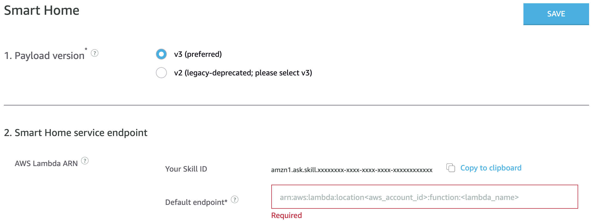

# 6. Configure the Skill

In this step you will configure the Alexa skill and fill out the required settings.

## Configure the Smart Home settings

Go back to the browser tab containing the Alexa skill settings in the Alexa Developer Console, and find the "Smart Home service endpoint" section.

1. Enter the ARN saved in your `setup.txt` file as **[AWS Lambda ARN]** into the *Default endpoint* field. The ARN should look something like: `arn:aws:lambda:region:XXXXXXXXXXXX:function:skill-sample-smarthome-fireplace-python`
2. Click the **Save** button.

## Configure the Account Linking settings

Fill out the required entities for account linking and copy your unique redirect URLs for configuring the return URLs of the security profile.

1. Beneath the "Smart Home service endpoint" settings, click on the **Setup Account Linking** button.
2. On the *Account Linking* page, for the *Authorization URI*, enter `https://www.amazon.com/ap/oa`.
3. For the *Access Token URI*, enter `https://api.amazon.com/auth/o2/token`.
4. For the *Client ID*, copy and paste the previously saved **[Security Profile Client ID]** value from the `setup.txt` file.
5. For the *Client Secret*, copy and paste the previously saved **[Security Profile Client Secret]** value from the `setup.txt` file.
6. For *Your Authentication Scheme* leave **HTTP Basic (Recommended)** selected.
7. Under *Scope*, click the **+ Add scope** link and then add the following scope into the text box that says *Enter scope...*: `profile:user_id`
8. Copy the three (3) redirect urls from the Redirect URLs section and save them to the **[Redirect URLs]** section of the `setup.txt` file.
9. Click **Save**.

## Set the Allowed Return URLs

1. Open [https://developer.amazon.com/iba-sp/overview.html](https://developer.amazon.com/iba-sp/overview.html) and make sure *Settings* is selected in the top menu and *Security Profiles* is selected in the sub menu.
2. Select the **Skill Sample** Security Profile.
3. On the *Security Profile Management* page, select the **Web Settings** tab.
4. In the *Web Settings*, click the **Edit** button.
5. In the Allowed Return URLs text input, add each of the saved Redirect URLs from the `setup.txt` file. You will need to click the **Add Another** link to add each Return/Redirect URL. Each of the Return/Redirect URLs will have a format similar to `https://pitangui.amazon.com/api/skill/link/XXXXXXXXXXXXXX`
6. Click **Save**.

## Checkpoint
You should now have a have a fully configured Alexa skill that handles the Smart Home interaction models and has Account Linking configured.
 
Next to Step [7. Deploy the Sample Code](deploy-the-sample-code.md)

___
Return to the [Instructions](README.md)