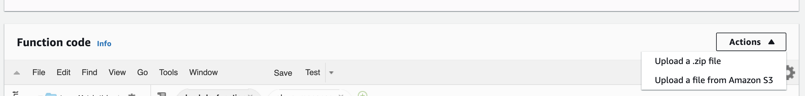
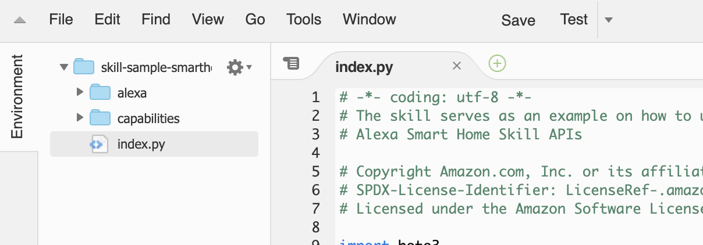

# 7. Deploy the Sample Code

In this step you will package up Lambda code, then upload it to the AWS Lambda function that was created for you by CloudFormation.

## Package the Sample Code

1. Browse to the *skill-sample-smarthome-fireplace-python/lambda/* directory.
2. You will notice an *index.py*, an *alexa/* folder, a *capabilities/*, and an *events/* folder in this directory. Zip these into a file named `package.zip`. Make sure that the index.py file and the folders are at the root of the zip file. Do not include the full *skill-sample-smarthome-fireplace-python* path structure. For example, if you are using macOS, you can execute the following command to zip only the required folder and file.

        zip -r package.zip alexa/ capabilities/ events/ index.py

3. Verify the contents of the package.zip file has a structure that looks like the following:

```
/alexa/
/capabilities/
/events/
/index.py
```

If you encounter any issues, refer to the [AWS Documentation for Creating a Deployment Package (Python)](https://docs.aws.amazon.com/lambda/latest/dg/python-package.html).

## Upload the Sample Code

1. Navigate to [https://console.aws.amazon.com/lambda/home?region=us-east-1#/functions/skill-sample-smarthome-fireplace-python?tab=configuration](https://console.aws.amazon.com/lambda/home?region=us-east-1#/functions/skill-sample-smarthome-fireplace-python?tab=configuration), changing the region if necessary, and locate the *Function code* section.
2. In the *Actions* dropdown, select **Upload a .zip file**.

    

3. Click the **Upload** button and browse to the directory or where you zipped the packaged code.
4. Select the `package.zip` file.
5. Click the **Save** button. If successful, the environment of the *Function code* section will update with an alexa/ folder and index.py file replacing the previous contents.

    

Next [8. Update the Code](update-the-code.md)

___
Return to the [Instructions](README.md)
