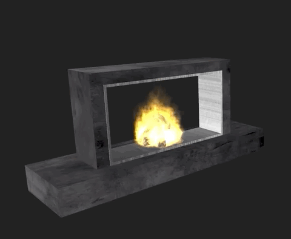

# 9. Start the Client

To have our virtual fireplace respond to events from Alexa, you need to run a client that listens for messages on your SQS queue and shows a virtual fireplace that responds to events.

## Run the Node Client

1. From the command line, navigate to the client directory of your *skill-sample-smarthome-fireplace-python* directory.
2. Open `fireplace.js` file in the _/src_ directory and update the `region`, `sqsQueueUrl`, and `IdentityPoolId` variables, which are marked with `// TODO replace ...` comments.
3. From the `client` directory, run the command `npm install` from the command line.
4. From the same `client` directory, run the command `npm run start` to start the client.
5. Once started, visit [http://localhost:9000/](http://localhost:9000) to view the virtual fireplace.
6. Leave the webpage open and the client running in the background and proceed with the next step.

## Checkpoint
The client should now be running on your computer and listening for messages from your Alexa skill handler. You should see fireplace burning. In the next step, you'll be able to power the virtual fireplace off and on.

Next to Step [10. Test the Skill](test-the-skill.md)

___
Return to the [Instructions](README.md)
