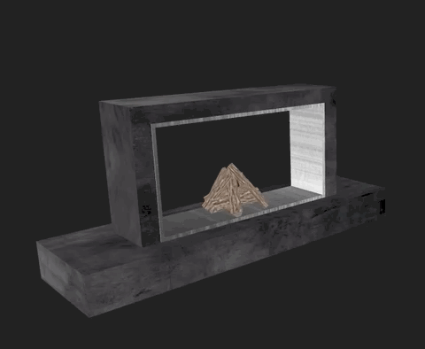

# 10. Test the Skill

To test the Smart Home skill on a device, it must first be enabled and linked to your Amazon developer account.

## Link the Skill

Before you can use your skill, you need to link your Amazon account to the skill.

> Alternatively you can do the Account Linking steps below from the Alexa app

1. Browse to [https://alexa.amazon.com](https://alexa.amazon.com).
2. Select *Skills* from the left menu.
3. Click the **Your Skills** button from the top-right corner.
4. In the search box type *Fireplace* and your skill will show up. It should say "Account linking required". Click on it.
5. Click on the **Enable** button and sign in as necessary and click *Allow* to sign in to Skill Sample.
6. If successful, you should receive a confirmation similar to "Fireplace has been successfully linked."
7. Close the tab and you should see a message prompt that offers you to detect devices. Go ahead and detect them (alternatively you can click on *Smart Home* on the left navigation menu items, click on the **Devices** button, scroll all the way down and click on the **Discover** button).
8. When complete, a new discovered device called "Fireplace" will appear in your Smart Home Devices list which supports being turned on and off.

## Send a Request to Alexa

### Option 1: Use an Alexa Device

1. Using Alexa, say "Alexa, turn off the fireplace. If successful, Alexa should respond with an "OK", and in your browser you should notice the flame go down. If not successful, Alexa may respond with "There was a problem with the requested skill's response" and the flame in your browser should remain the same. If your skill does not work correctly, you will need to review your logs and troubleshoot.

2. To bring the flame back up to full strength, say: "turn on the fireplace"

### Option 2: Use the Alexa App

1. Download the Alexa app on your mobile device and log in to your account. Select More -> Skills & Games -> Your Skills -> select the Dev tab on the far right.
2. Scroll to "Fireplace" and enable the skill.
3. Now, go back to the Home button in the bottom toolbar. Tap the Alexa icon, or say "Alexa," then "turn off the fireplace."
4. To bring the flame back up to full strength, say: "turn on the fireplace".

### Option 3: Use the Alexa Developer Console

1. Navigate to the ASK developer console at [https://developer.amazon.com/alexa/console/ask](https://developer.amazon.com/alexa/console/ask) and select the *Fireplace* skill.
2. Open the **Test** tab from the top menu.
3. Type or say the following: `turn off the fireplace`
4. To bring the flame back up to full strength, type or say the following: `turn on the fireplace`

If successful, Alexa should respond with an "OK", and in your browser you should notice the flame go down, then back up when you turn it on. If not successful, Alexa may respond with "There was a problem with the requested skill's response" and the flame in your browser should remain the same. If your skill does not work correctly, you will need to review your logs and troubleshoot.

## Checkpoint

You should now have a skill that uses the Smart Home API _PowerController_ to control a virtual fireplace! 

Next to Step [11. Clean Up](clean-up.md)

___
Return to the [Instructions](README.md)
