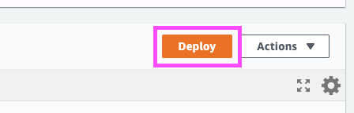
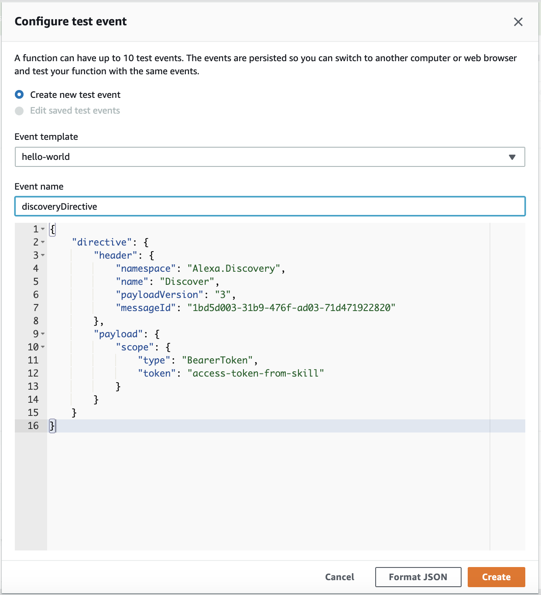
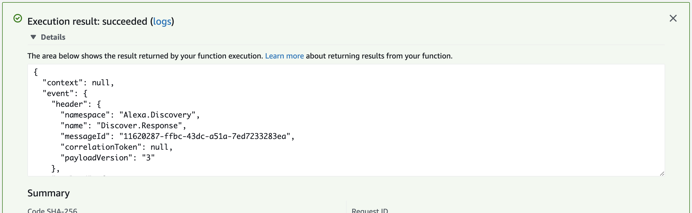

# 8. Update the Code

In this section you will explore the sample code, and make updates that will enable your function to send messages to your virtual fireplace.

## Examine the Code that Provides a Response to a Request

### Handler for Smart Home Requests

The `def lambda_handler(...):` confirms that there is a `directive` in the JSON request, indicating that there is a Smart Home directive.

```python
if 'directive' not in request:
        response = AlexaResponse({
            'name': 'ErrorResponse',
            'payload': {'type': 'INVALID_DIRECTIVE',
                        'message': 'Missing key: directive, Is the request a valid Alexa Directive?'}
        })
        return send_response(response)
```

The code also looks for a namespace (in this case, _Alexa.PowerController_) in the JSON request.

```python
...    

if namespace == 'Alexa.PowerController':
    # Note: This sample always returns a success response for either a request to TurnOff or TurnOn
    endpoint_id = request['directive']['endpoint']['endpointId']
    power_state_value = 'OFF' if name == 'TurnOff' else 'ON'
    ...
```

If an appropriate directive is found, a message is sent to your SQS queue, which your virtual fireplace will also monitor for instructions.

## Edit the Code to Send a Message

Edit the handler code to enable sending a message to your queue.

1. In _index.py_, confirm the `region_name` variable of `config = Config(region_name = "us-east-1")` is the same region as your SQS queue.
2. Replace the value of the `sqs_queue_url` variable with the **[Amazon SQS Queue Url]** value from the `setup.txt` file. The value you will want to replace looks like `https://sqs.region.amazonaws.com/XXXXXXXXXXXX/FireplaceEventQueue`.
3. Click the **Deploy** button in the top-right corner of the Lambda console.

    

## Test the code`

In this section, you’ll test the changes to the handler code by simulating an Alexa Request for a Smart Home message:

### Send a Smart Home Test Event

#### Discovery Event

1. On the function page for _skill-sample-smarthome-fireplace-python_, select the **Select a test event** dropdown from the top menu of the function and click **Configure test events**.
2. In the dialog that opens, leave **Create new test event** selected and leave the default template.
3. For the _Event name_ enter: `directiveDiscovery`.
4. Copy and paste the contents of [Discovery.request.json](https://github.com/alexa/skill-sample-smarthome-fireplace-python/blob/main/lambda/events/Discovery.request.json) into the text field at the bottom of the dialog, replacing its contents.

    

5. Click **Create**.
6. With the *directiveDiscovery* test selected in the dropdown, click **Test**.
7. Open the **Execution result** details to inspect the result and notice that your handler now returns a `Discover.Response` and the definition of a "Fireplace" device.

    

Any errors with the code or packaging and deployment of the code will be reflected in the result response. Note that on a successful response, the event namespace is `Alexa.Discovery`. This is because the code is responding to a test event that sends in a Discovery directive. 

#### PowerController Event (Optional)

Repeat the same steps above to create a test event for an `Alexa.PowerController` directive from Alexa. For the _Event name_ enter `directivePower`. Copy and paste the contents of [PowerController.request.json](https://github.com/alexa/skill-sample-smarthome-fireplace-python/blob/main/lambda/events/PowerController.request.json) into the text field at the bottom of the dialog, replacing its contents, then click the **Create** button.

With the **directivePower** test selected in the dropdown, click **Test**, and inspect the execution result to find a successful "TurnOn" event.

## Checkpoint
The skill handler code should appropriately respond to Smart Home messages.
 
Next to Step [9. Start the Client](start-the-client.md)

___
Return to the [Instructions](README.md)